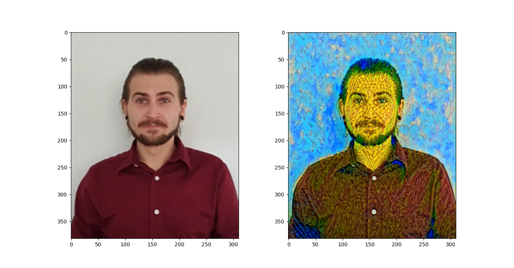
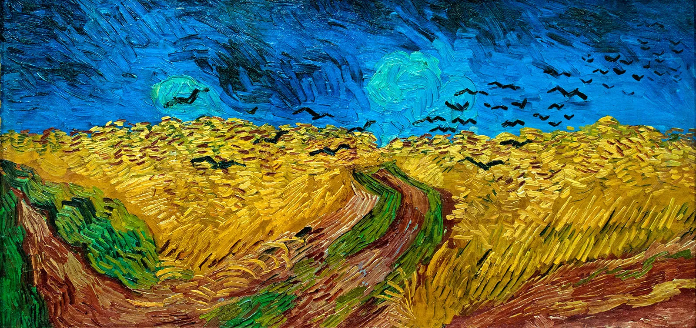

# CNN Image Style Transfer using VGG19 and PyTorch

Author: Jacob Pitsenberger

Date: 12-28-23

A PyTorch project implementing neural style transfer using the VGG19 model, combining the content of one image with the style of another for artistic transformations.


   

   
   
   
   *Wheatfield with Crows Painting by Vincent van Gogh*

## Project Overview

This PyTorch Style Transfer project applies neural style transfer using a VGG19 model. The following steps were taken:

1. **Load Pre-trained VGG Net:**
   - The script loads a pre-trained VGG19 model and freezes its weights to use it as a fixed feature extractor in the start of the `main` function.

2. **Load and Transform Images:**
   - Content and style images are loaded using the `load_image` function, which transforms them into PyTorch tensors.

3. **Visualize Content and Style:**
   - The `display_content_and_style_images` function is used to visualize the loaded content and style images side-by-side.

4. **Extract Features:**
   - The `get_features` function extracts features from the VGG model for specified layers.

5. **Gram Matrix Calculation:**
   - The `gram_matrix` function calculates the Gram Matrix for a given convolutional layer.

6. **Define Loss Functions:**
   - Content and style loss functions are defined in the `image_style_transfer` function for iteratively updating the target image.

7. **Perform Style Transfer:**
   - Style transfer is performed using the `image_style_transfer` function, iterating over a set number of steps.

8. **Display Intermediate Results:**
   - Intermediate results are displayed at specified intervals during the optimization process as defined in the `image_style_transfer` function.

9. **Main Execution:**
   - The `main` function orchestrates the entire style transfer process by defining model, loading images, and initiating the style transfer.

Feel free to experiment with different content and style images by adjusting the image paths in the `main` function.


# Purpose of the Project

This project serves as a practical application and demonstration of the knowledge gained during the Udacity course "Intro to Deep Learning with PyTorch," focusing on the application of Style Transfer. The primary objectives were:

1. **Understanding Neural Style Transfer**: Implementing the neural style transfer technique, a fascinating application of deep learning that combines the content of one image with the style of another.

2. **Utilizing Pre-trained VGG19 Model**: Leveraging the VGG19 model, pre-trained on ImageNet, as a fixed feature extractor to extract content and style features from images.

3. **Gram Matrix Calculation**: Demonstrating the computation of the Gram Matrix, a crucial step in capturing the style representation of an image.

4. **Optimizing Target Image**: Iteratively updating a target image to minimize the content loss and style loss, achieving a stylized image that combines the content and style features.

5. **Showcasing PyTorch Skills**: Showcasing proficiency in PyTorch, including loading images, defining and training models, and using GPU acceleration for efficient computations.

This project provides hands-on experience in applying deep learning concepts to artistic image transformations, with a focus on neural style transfer techniques.


## Project Structure

- **style_transfer.py**: Main module for style transfer implementation.
- **images**: Directory containing input images for content and style and the output target image.

## Setup

1. Install required dependencies:
    ```bash
    pip install torch torchvision Pillow matplotlib numpy
    ```

2. Run the main script:
    ```bash
    python style_transfer.py
    ```

## Module Details

### `load_image`

Load and transform an image, ensuring it is <= 400 pixels in the x-y dimensions.

### `im_convert`

Display a PyTorch tensor as an image.

### `display_content_and_style_images`

Display the content and style images side-by-side.

### `print_vgg_layers`

Print the layers of the VGG model.

### `get_features`

Run an image forward through a model and get the features for a set of layers.

### `gram_matrix`

Calculate the Gram Matrix of a given tensor.

### `display_target_image`

Display the target image along with the content image side-by-side and save this to the **images** directory.

### `image_style_transfer`

Perform style transfer on the content image using the style image.

### `main`

Main function for executing the PyTorch Style Transfer project.

## Usage

1. Run the script `style_transfer.py`.
2. The script loads a pre-trained VGG19 model and freezes its parameters.
3. It loads content and style images from the `images` directory. To experiment with different content and style images, modify the paths in the `main` function where `content_path` and `style_path` are specified.
4. Style transfer is performed, and intermediate results are displayed.

Feel free to customize the `content_path` and `style_path` variables in the `main` function to point to different images and observe the style transfer outcomes.

# License
This project is licensed under the MIT License - see the [LICENSE](LICENSE.txt) file for details.